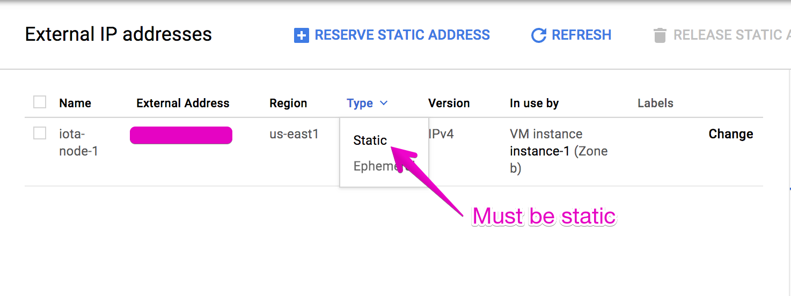
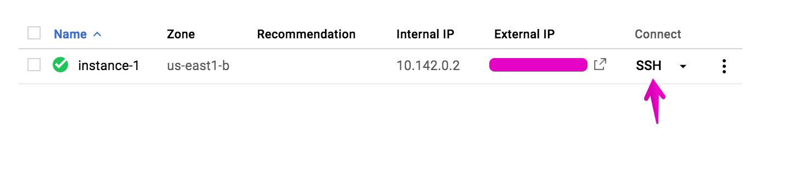

## Getting IRI running on a Google Cloud Instance

Google Cloud gives you $300 in free credit once you join, so that's a node running
for free for at least 3 months.

**Table of Contents:**

[Starting Your Instance](#starting-your-instance)  
[Installing IRI](#installing-iri)  
[Monitoring IRI](#monitoring-iri)  
[Installing Nelson](#installing-nelson) (Only Nelson, no manual neighbors)  
[Installing Nelson with manual neighbors](#installing-nelson-with-manual-neighbors)  

### Starting Your Instance

1. Make a Google Cloud account (https://console.cloud.google.com/).

2. Once created and logged in, you have to create a project.

  

3. Once the box opens, create a new project "+", call it "Iota".

4. In the search box, type in `Instance`, and click on the result that says `Instances, Compute Engine`.

5. It'll take some time to start this service, but once it's started, click "Create".

6. Call the instance something like, "iota-full-node-1"

7. Pick a zone, if you're in the US, pick east, central, or west. The closer it is to you, the faster you can
ssh, etc. Here's the location of all specific zones: (https://cloud.google.com/compute/docs/regions-zones/)

8. Pick at least 2vCPU and 4gb or ram, recommended is 6gb+ and 4 cores, but that can get pricey.
***Update 12/26/2017:*** After extensive testing, all you really need is 2core/6gb/128gb (SSD Recommended).

9. Change your boot disk to Ubuntu 17.10, it's the latest and won't require a reboot. Make sure you give yourself at least
96gb of HD space (I recommend). Pick SSD for faster read/write or standard for cheaper but slower read/write.

10. **Important:** Under Identity and API access, make sure "Allow full access to all Cloud APIs" is checked.

11. **Important:** Under Firewall, make sure "Allow HTTP traffic" and "Allow HTTPS traffic" is checked.

12. Create instance, once it's done we have to enable all the ports.

13. We must enable all the ports for IRI and nelson to work properly, In the search box type `External IP addresses`. You'll see your server, make sure you change the IP from `Ephemeral` to `Static`.

  

14. Now we have to enable the necessary ports. Click `Firewall rules` on the left side. Create a new firewall rule,
we have 4 ports we have to open (14265, udp 14600, tcp 15600, and 16600 for nelson).

15. Start with 14265, call it something like iota-14265-in,   
Direction of traffic: `Ingress`  
Action on match: `Allow`,  
Targets:  `All instances in the network`  
IP ranges: `0.0.0.0/0`  
Specified protocols and ports: `tcp; udp:14265;`

16. Repeat this except call the new one iota-14265-out, and Direction of traffic: `Egress`.

17. Repeat the same for port 16600.

18. For udp 14600, you only have to do Specified protocols and ports: `udp:14600;`, for tcp `tcp:15600`.

19. Remember to do both in and out ( `Ingress` and `Egress` ).

20. Go back to Instances, Google Compute, click on `SSH` to access the shell and part 2, Installing IRI.

  

### Installing IRI  

We have to do a bit of maintenance on the server and upgrade all the things we need to get up and running.

1. Lets upgrade as needed:
```bash
sudo apt update -qqy --fix-missing && sudo apt-get upgrade -y && sudo apt-get clean -y && sudo apt-get autoremove -y --purge
```  
2. We're going to install the Oracle version of Java 8, make sure you accept the license agreement.
```bash
sudo apt install software-properties-common -y && sudo add-apt-repository ppa:webupd8team/java -y && sudo apt update && sudo apt install oracle-java8-installer curl wget jq git -y && sudo apt install oracle-java8-set-default -y
```
3. Lets add 2 users, one for IOTA and one for nelson in the future. This is for security.
```bash
sudo useradd -s /usr/sbin/nologin -m iota
sudo useradd -s /usr/sbin/nologin -m nelson
```
4. Lets create directories where everything will live.
```bash
sudo -u iota mkdir -p /home/iota/node /home/iota/node/ixi /home/iota/node/mainnetdb
```
5. Lets download the latest IRI and put it in the node directory.
```bash
sudo -u iota wget -O /home/iota/node/iri-1.4.1.4.jar https://github.com/iotaledger/iri/releases/download/v1.4.1.4/iri-1.4.1.4.jar
```
6. We want to create a service for IRI, just in case you reboot or if you want to start it then stop it.
```bash
sudo nano /lib/systemd/system/iota.service
```
***IMPORTANT:*** Then paste, but remember to remove `{{ SUBSTITUTE }}` and substitute with your server's ram. Here's a simple chart:
- 4gb: `-Xmx3g`
- 6gb: `-Xmx4500m` or `-Xmx4g`
- 8gb: `-Xmx6144m` or `-Xmx6g`
- 10gb: `-Xmx8192m` or `-Xmx8g`
- 12gb: `-Xmx10240m` or `-Xmx10g`
- 16gb: `-Xmx14336m` or `-Xmx14g`  

So the line will read:   
```bash
ExecStart=/usr/bin/java -Xmx6144m -Djava.net.preferIPv4Stack=true -jar iri-1.4.1.4.jar -c iota.ini` for an 8gb server.
```

Paste this:  

```bash
[Unit]
Description=IOTA (IRI) full node
After=network.target

[Service]
WorkingDirectory=/home/iota/node
User=iota
PrivateDevices=yes
ProtectSystem=full
Type=simple
ExecReload=/bin/kill -HUP $MAINPID
KillMode=mixed
KillSignal=SIGTERM
TimeoutStopSec=60
ExecStart=/usr/bin/java {{ SUBSTITUTE }} -Djava.net.preferIPv4Stack=true -jar iri-1.4.1.4.jar -c iota.ini
SyslogIdentifier=IRI
Restart=on-failure
RestartSec=30

[Install]
WantedBy=multi-user.target
Alias=iota.service
```

7. Save with `Ctrl + X`, then `Y`, then `Enter`
8. To enable the service type:
```bash
sudo systemctl daemon-reload && sudo systemctl enable iota.service
```
You can now start/stop/restart the service with: `sudo service iota start|stop|restart|status`

9. Now we have to configure IRI. Type this into the terminal:
```bash
cat << "EOF" | sudo -u iota tee /home/iota/node/iota.ini
```
Then paste the following, remember to add a few RELIABLE neighbors. Reliable neighbors have NEW incoming transactions. You can ask for neighbors on the iotatangle.slack. People are having luck with TCP vs. UDP. I have no idea because syncing is out of whack. Press enter once you pasted and entered neighbors.
```bash
[IRI]
PORT = 14265
UDP_RECEIVER_PORT = 14600
TCP_RECEIVER_PORT = 15600
API_HOST = 0.0.0.0
IXI_DIR = ixi
HEADLESS = true
DEBUG = false
TESTNET = false
DB_PATH = mainnetdb
RESCAN_DB = true
REMOTE_LIMIT_API="removeNeighbors, addNeighbors, interruptAttachingToTangle, attachToTangle, getNeighbors"
NEIGHBORS = {{ NEIGHBORS GO HERE }}
EOF
```

10. Now we have to add a Database so IRI has a starting point for syncing. First we made (previously) the directory for the db, then we download the database inside. Lets navigate to the iota directory.
```bash
cd /home/iota/node/
```
Then download and copy the database into the directory, then delete the download (it's big, like 8gb). ***This will take some time.***
```bash
sudo curl -O http://db.iota.partners/IOTA.partners-mainnetdb.tar.gz && sudo tar xzfv ./IOTA.partners-mainnetdb.tar.gz -C ./mainnetdb && sudo rm ./IOTA.partners-mainnetdb.tar.gz && sudo service iota start
```

11. We are ready to start the IRI node for the first time.
```bash
sudo service iota start
```

12. Lets enable auto-updating of the IRI if there's a new version. This will check for a new version every 15 minutes.
```bash
echo '*/15 * * * * root bash -c "bash <(curl -s https://gist.githubusercontent.com/zoran/48482038deda9ce5898c00f78d42f801/raw)"' | sudo tee /etc/cron.d/iri_updater > /dev/null
```
### Monitoring IRI

1. Check the health of the Node with this command, make sure you have no errors:
```bash
journalctl -u iota -f
```

2. Show all neighbors you have now:
```bash
curl http://localhost:14265 -X POST -H 'Content-Type: application/json' -H 'X-IOTA-API-Version: 1.4' -d '{"command": "getNeighbors"}' | jq
```

3. Show IRI Status:  
***PLEASE NOTE:*** It takes a long time to get up from milestone 243000 to the current one, be it with nelson or manual neighbors.
```bash
curl http://localhost:14265 -X POST -H 'Content-Type: application/json' -H 'X-IOTA-API-Version: 1.4' -d '{"command": "getNodeInfo"}' | jq
```

4. If IRI gets stuck on a milestone, you need to stop the service, delete the database and database logs, redownload the database, install it, and restart iota service.

5. Add/Remove Neighbors, useful for removing nelson neighbors with 0 incoming new transactions:

Add Neighbors:
```bash
curl -H 'X-IOTA-API-VERSION: 1.4' -d '{"command":"addNeighbors", "uris":[
  "tcp://ip-of-the-new-neighbor:12345", "udp://ip-of-the-new-neighbor:54321"
]}' http://localhost:14265
```
Remove Neighbors:  
```bash
curl -H 'X-IOTA-API-VERSION: 1.4' -d '{"command":"removeNeighbors", "uris":[
  "tcp://ip-of-the-new-neighbor:12345", "udp://ip-of-the-new-neighbor:54321"
]}' http://localhost:14265
```

### Installing Nelson

1. Install nodejs 8+ and npm:
```bash
curl -sL https://deb.nodesource.com/setup_8.x | sudo -E bash -
sudo apt-get install -y nodejs
```

2. Navigate to your home directory and create a nelson directory
```bash
sudo -u nelson mkdir /home/nelson
```

3. Install nelson globally.
```bash
sudo npm install -g nelson.cli
```

4. Run this command and then paste in the config.
```bash
cat << "EOF" | sudo -u iota tee /home/nelson/config.ini
```
Config:
```
[nelson]
cycleInterval = 60
epochInterval = 300
apiPort = 18600
apiHostname = 127.0.0.1
port = 16600
IRIHostname = localhost
IRIPort = 14265
TCPPort = 14600
UDPPort = 15600
dataPath = data/neighbors.db
incomingMax = 5
outgoingMax = 4
isMaster = false
silent = false
gui = false
getNeighbors = https://raw.githubusercontent.com/SemkoDev/nelson.cli/master/ENTRYNODES
; add as many initial Nelson neighbors, as you like
neighbors[] = mainnet.deviota.com/16600
neighbors[] = mainnet2.deviota.com/16600
neighbors[] = mainnet3.deviota.com/16600
neighbors[] = iotairi.tt-tec.net/16600
EOF
```

5. If you haven't started your IRI service, start it now. Start nelson with:
```bash
sudo nelson --config /home/nelson/config.ini
```

6. Keep an eye on your neighbors with the getNeighbors API call. Paste it in and check every 2-4 minutes.
```bash
curl http://localhost:14265 -X POST -H 'Content-Type: application/json' -H 'X-IOTA-API-Version: 1.4' -d '{"command": "getNeighbors"}' | jq
```

7. If you're stuck with a neighbor that's not producing new transactions, like this one (example), or they're producing invalid transactions, remove them:
```json
{
  "address": "example.neighbor:15600",
  "numberOfAllTransactions": 6535,
  "numberOfRandomTransactionRequests": 0,
  "numberOfNewTransactions": 0,
  "numberOfInvalidTransactions": 0,
  "numberOfSentTransactions": 11299,
  "connectionType": "tcp"
}
```

Remove the naughty neighbor manually with this command:

```curl
curl -H 'X-IOTA-API-VERSION: 1.4' -d '{"command":"removeNeighbors", "uris":[
  "tcp://example.neighbor:15600"
]}' http://localhost:14265
```

Remember to have the connection type before their address.

8. If you get stuck on a number **HIGHER** than 243000 for longer than 30 minutes, run this command and start all over:
```bash
sudo rm -r /home/iota/node/mainnet.log && sudo rm -r /home/iots/node/mainnetdb && sudo -u iota mkdir /home/iota/node/mainnetdb && cd /home/iota/node && sudo curl -O http://db.iota.partners/IOTA.partners-mainnetdb.tar.gz && sudo tar xzfv ./IOTA.partners-mainnetdb.tar.gz -C /home/iota/node/mainnetdb && sudo rm ./IOTA.partners-mainnetdb.tar.gz && sudo service iota start && sudo nelson --config /home/nelson/config.ini
```

9. It takes patience.

I'm running 6 nodes now, please help out the cost by donating here:

ETH:  `0x80db79A9ECA38Bc790b80FA06F42683A5FCfB32A`   
IOTA: `AHKTYQKUMNUIEVSXYBJSRMRYSMGNTKSLHIUZRCHJIJJUZ9WUYUXISAXHUJUESQVIAIZDBGUBIGENYOSNBPKCELWZRX`